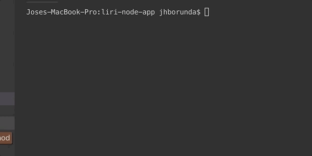
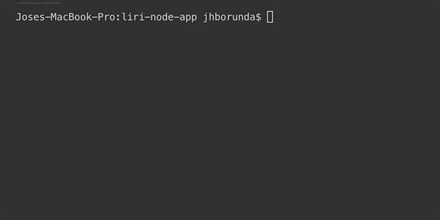

# liri-node-app

LIRI-node-app is giving users the flexability to type a band name/artist name/& movie name and returning values that are beneficial to the users search query.

1A. First portion of code built for this assignment is "concert-this". Users have to input the following into the terminal: 'node liri.js concert-this <artist/band name here>'. This will return the venue, city, and date. 

See gif below for a DEM0:

1B. Second portion of code built for this assignment is "spotify-this-song". Users have to input the following into the terminal: `node liri.js spotify-this-song '<song name here>'. This will return artist(s), the song's name, a preview link of the song from Spotify, and the album the song is from. 

See gif below for a DEM0:

1C. Third portion of code build for this assignment is "movie-this". Users have to input the following into the terminal: 'node liri.js movie-this '<movie name here>'. This will return titile of the movie, year the movie came out, IMBD rating of the movie, Rotten Tomatoes rating of the movie, country where the movie was produced, language of the movie, and actors in the movie. 

See gif below for a DEM0:

1D. Fourth portion of code built for this assignment is "do-what-it-says". Users have to input the following into the terminal: 'node liri.js do-what-it-says'. This will return a heart throbing song for teenage girls of 1999 "I Want It That Way"!. 

See gif below for a DEM0:

This assignment allowed me to gain more knowledge on NodeJS and also gave me the ability to get more familiar with NPM and the associated items that had to be NPM-Installed. What I learned from class is that Node.JS "is an open source, cross-platorm JavaZScript runtime environment designed to be run outside of browsers."
